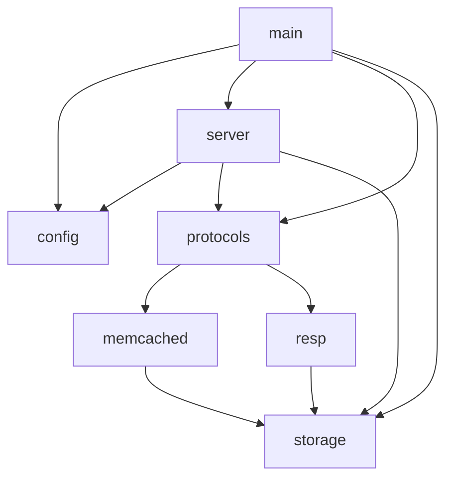

# grow-a-cache Architecture

## Module Dependency Diagram

## Module Descriptions

- **main**: Entry point that initializes logging, loads configuration, creates the server instance, and starts the async runtime.

- **config**: Handles configuration loading from CLI arguments (via clap) and TOML files (via serde), with CLI taking precedence; includes `ProtocolType` enum for protocol selection.

- **server**: Protocol-agnostic TCP server that accepts connections, manages connection limits via semaphore, dispatches to the configured protocol handler, and runs a background expiration cleanup task.

- **protocols**: Parent module that re-exports protocol-specific handlers; each protocol is a self-contained vertical slice.
  - **memcached**: Memcached text protocol implementation with parser (commands, responses) and handler (command execution against storage).
  - **resp**: Redis RESP2/3 protocol implementation with parser (frame types) and handler (GET, SET, DEL, PING, HELLO, COMMAND).

- **storage**: Thread-safe in-memory key-value store with automatic expiration, LRU eviction when memory limits are reached, and CAS (compare-and-swap) support.
