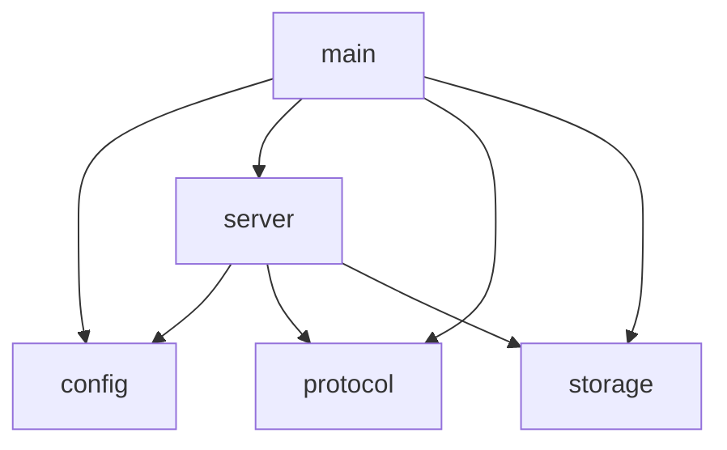

# grow-a-cache Architecture

## Module Dependency Diagram

## Module Descriptions

- **main**: Entry point that initializes logging, loads configuration, creates the server instance, and starts the async runtime.

- **config**: Handles configuration loading from CLI arguments (via clap) and TOML files (via serde), with CLI taking precedence over file values.

- **server**: TCP server that accepts memcached connections, manages connection limits via semaphore, spawns per-connection handlers, and runs a background expiration cleanup task.

- **protocol**: Parses the memcached text protocol commands (get, set, delete, cas, etc.) and generates properly formatted responses.

- **storage**: Thread-safe in-memory key-value store with automatic expiration, LRU eviction when memory limits are reached, and CAS (compare-and-swap) support.
