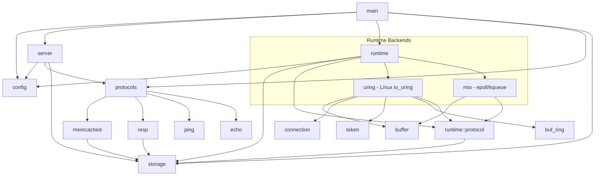

# grow-a-cache Architecture

## Module Dependency Diagram

## Module Descriptions

- **main**: Entry point that initializes logging, loads configuration, and dispatches to the selected runtime (Tokio, native io_uring/kqueue, or mio).

- **config**: Handles configuration loading from CLI arguments (via clap) and TOML files (via serde), with CLI taking precedence. Includes `ProtocolType` enum for protocol selection and `RuntimeType` enum for runtime selection.

- **server**: Tokio-based protocol-agnostic TCP server that accepts connections, manages connection limits via semaphore, dispatches to the configured protocol handler, and runs a background expiration cleanup task.

- **runtime**: Custom high-performance networking runtimes for Linux and macOS.
  - **uring** (Linux only): io_uring-based completion I/O with provided buffer rings (kernel 5.19+).
    - **buf_ring**: Kernel-managed buffer selection for zero-copy reads.
    - **connection**: Connection state machine for tracking read/write progress.
    - **token**: Operation tracking for correlating completions with requests.
  - **mio** (Linux + macOS): Readiness-based I/O using mio (epoll on Linux, kqueue on macOS).
  - **buffer**: Per-worker buffer pool for efficient memory management.
  - **protocol**: Protocol processing shared by all native runtimes.

- **protocols**: Parent module that re-exports protocol-specific handlers; each protocol is a self-contained vertical slice.
  - **memcached**: Memcached text protocol implementation with parser (commands, responses) and handler (command execution against storage).
  - **resp**: Redis RESP2/3 protocol implementation with parser (frame types) and handler (GET, SET, DEL, PING, HELLO, COMMAND).
  - **ping**: Simple ping/pong test protocol.
  - **echo**: Echo test protocol.

- **storage**: Thread-safe in-memory key-value store with automatic expiration, LRU eviction when memory limits are reached, and CAS (compare-and-swap) support.

## Runtime Options

| Flag | Linux | macOS | Description |
|------|-------|-------|-------------|
| `--runtime tokio` | Tokio (epoll) | Tokio (kqueue) | Stable async runtime (default) |
| `--runtime native` | io_uring | mio/kqueue | High-performance native I/O |
| `--runtime mio` | mio/epoll | mio/kqueue | Readiness-based (for comparison) |
