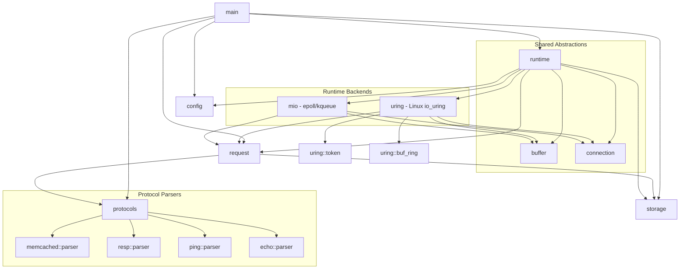

# grow-a-cache Architecture

## Module Dependency Diagram

## Module Descriptions

- **main**: Entry point that initializes logging, loads configuration, and dispatches to the selected runtime (mio or io_uring).

- **config**: Handles configuration loading from CLI arguments (via clap) and TOML files (via serde), with CLI taking precedence. Includes `ProtocolType` enum for protocol selection and `RuntimeType` enum for runtime selection.

- **request**: Request processing layer that orchestrates protocol parsing and storage operations. Handles Memcached, RESP, Ping, and Echo protocols by parsing input, executing commands against storage, and formatting responses.

- **runtime**: Custom high-performance I/O runtimes for Linux and macOS.
  - **buffer**: Per-worker buffer pool with `BufferPool` for efficient memory management and `BufferChain` for large value accumulation across multiple buffers.
  - **connection**: Connection state machine with control plane (`ConnPhase`: Accepting→Established→Closing) and data plane (`DataState`: Reading↔Writing) separation.
  - **uring** (Linux only): io_uring-based completion I/O with provided buffer rings (kernel 5.19+).
    - **buf_ring**: Kernel-managed buffer selection for zero-copy reads.
    - **token**: Operation tracking for correlating completions with requests.
  - **mio** (Linux + macOS): Readiness-based I/O using mio (epoll on Linux, kqueue on macOS).

- **protocols**: Protocol parser implementations (syntax only, no execution logic).
  - **memcached**: Memcached text protocol parser with `Command` enum, `Parser`, and `Response` formatting.
  - **resp**: Redis RESP2/3 protocol parser with `Frame` types and encoding/decoding.
  - **ping**: Simple line-based ping/pong protocol for latency testing.
  - **echo**: Length-prefixed binary echo protocol for throughput testing.

- **storage**: Thread-safe in-memory key-value store with automatic expiration, LRU eviction when memory limits are reached, and CAS (compare-and-swap) support.

## Runtime Options

| Flag | Linux | macOS | Description |
|------|-------|-------|-------------|
| `--runtime mio` | mio/epoll | mio/kqueue | Readiness-based I/O (default) |
| `--runtime uring` | io_uring | N/A (error) | Completion-based I/O (Linux 5.19+) |
