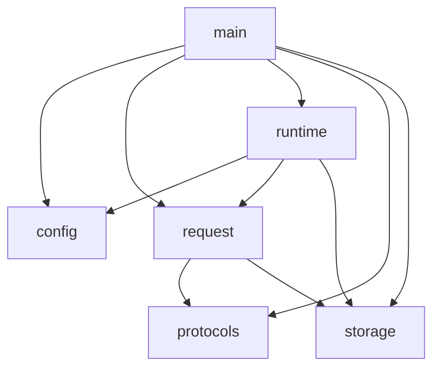

# v3 Discussion

## Session: 2026-01-08 - Large Value Support Analysis

### Context
v2 has a 64KB maximum payload limit because the native runtimes (io_uring, mio) require complete requests to fit in a single buffer. This session analyzes what it takes to support large values (e.g., 10MB) without running out of memory or limiting connection capacity.

### Memory Budget Analysis

#### Current v2 Memory Model

Per-worker memory usage with default settings:

| Component | Formula | With 64KB buffers |
|-----------|---------|-------------------|
| io_uring read ring | `ring_entries × buffer_size` | 4096 × 64KB = 256MB |
| Write buffer pool | `pool_size × buffer_size` | 4096 × 64KB = 256MB |
| **Total per worker** | | ~512MB |

With 8 workers: **~4GB** total buffer memory.

#### The Problem with Naive Large Buffer Scaling

If we simply increase `buffer_size` to 10MB to support 10MB values:

| Component | Formula | With 10MB buffers |
|-----------|---------|-------------------|
| io_uring read ring | `ring_entries × buffer_size` | 4096 × 10MB = 40GB |
| Write buffer pool | `pool_size × buffer_size` | 4096 × 10MB = 40GB |
| **Total per worker** | | ~80GB |

This is clearly unworkable.

### Key Insight: Separating Connection Buffers from Value Buffers

The current design conflates two different buffer purposes:

1. **Connection I/O buffers**: For reading/writing protocol data (headers, small commands)
2. **Value buffers**: For storing/transmitting large values

These have different characteristics:

| Aspect | Connection Buffer | Value Buffer |
|--------|-------------------|--------------|
| Lifetime | Per-read/write operation | Per-request duration |
| Size | Small (4-16KB typical) | Large (up to max_value_size) |
| Count needed | ~concurrent connections | ~concurrent large-value requests |
| Allocation | Pool (fast) | On-demand or pool (large-value pool) |

### Design Considerations

#### 1. Maximum Value Size Configuration

**Requirement**: The server should reject values larger than a configured maximum.

```rust
// In Config
pub max_value_size: usize,  // e.g., 10MB = 10 * 1024 * 1024
```

This enables:
- Early rejection of oversized requests (fail fast)
- Bounded memory for value buffers
- Clear contract with clients

**Protocol-specific enforcement**:
- **Memcached**: Parse `set key flags exptime <bytes>`, reject if `bytes > max_value_size`
- **RESP**: Parse bulk string prefix `$<length>`, reject if `length > max_value_size`
- **Echo**: Parse length prefix, reject if `length > max_value_size`

#### 2. Per-Connection Accumulation Buffer

For requests that span multiple I/O reads, we need to accumulate data:

```rust
struct Connection {
    // ... existing fields ...

    /// Accumulation buffer for multi-read requests.
    /// Allocated on-demand when first read doesn't complete the request.
    accum_buf: Option<Vec<u8>>,

    /// Expected total size (from protocol parsing).
    /// Allows pre-allocation and progress tracking.
    expected_len: Option<usize>,
}
```

**Memory control strategies**:

| Strategy | Pros | Cons |
|----------|------|------|
| Lazy allocation | No memory until needed | Allocation on hot path |
| Pre-sized allocation | Single allocation | Requires knowing size upfront |
| Chunked accumulation | Bounded memory | Copy overhead when assembling |
| Memory-mapped | Handles huge values | Complexity, disk I/O |

**Recommendation**: Pre-sized allocation when we know `expected_len` from protocol parsing.

#### 3. Memory Pressure and Backpressure

With large values, we need to prevent memory exhaustion:

**Option A: Global value memory budget**
```rust
struct ValueMemoryPool {
    allocated: AtomicUsize,
    limit: usize,  // e.g., 1GB total for in-flight values
}
```

When limit is reached:
- Reject new large-value requests with SERVER_ERROR
- Or apply backpressure (stop reading from connections)

**Option B: Per-connection value budget**
```rust
// In Config
pub max_value_per_connection: usize,  // e.g., 10MB
```

Simpler to reason about, but doesn't prevent many connections from exhausting memory.

**Option C: Admission control based on available memory**
```rust
fn can_accept_value(size: usize) -> bool {
    let current = VALUE_MEMORY.load(Ordering::Relaxed);
    current + size <= VALUE_MEMORY_LIMIT
}
```

**Recommendation**: Option A (global budget) with Option C (admission control). This provides system-wide protection while allowing fair distribution among connections.

#### 4. Large Value Responses (GET)

Returning large values has similar challenges:

**Current problem**: Response must fit in write buffer (`buffer_size`).

**Solution**: Streaming writes directly from storage.

```rust
pub enum ProcessResult {
    // ... existing variants ...

    /// Large response that streams from storage.
    StreamingResponse {
        consumed: usize,
        /// Key to stream from storage
        key: String,
        /// Byte range to send (for partial responses)
        range: Range<usize>,
    },
}
```

**Implementation flow**:
1. GET command parsed
2. Look up key in storage, get value reference (not copy)
3. Return `StreamingResponse` with key
4. Event loop writes directly from storage in chunks
5. Reference counting or copy-on-write prevents mutation during write

**Complexity**: Requires storage to support referenced access, not just copying.

#### 5. io_uring vs mio Considerations

**io_uring with provided buffer rings**:
- Kernel selects buffer from ring
- Cannot use large buffers efficiently (all buffers same size)
- For large values: receive into small buffer, copy to accumulation buffer

**mio (epoll/kqueue)**:
- Application controls buffer for each read
- Can read directly into appropriately-sized buffer
- Simpler path for large values

**Implication**: Large value support may be easier to implement cleanly in mio first.

#### 6. Zero-Copy Considerations

For maximum performance, avoid copying large values:

**Write path (SET)**:
```
Network → Kernel buffer → User buffer → Storage
          [1 copy]        [1 copy]
```

**Read path (GET)**:
```
Storage → User buffer → Kernel buffer → Network
          [1 copy]       [1 copy]
```

**Potential optimizations**:
- `splice()` from socket to storage (requires file-backed storage)
- `io_uring` with registered buffers (complex setup)
- Memory-mapped storage with `sendfile()` equivalent

**Recommendation**: Accept 2-copy path for v3. Zero-copy is a future optimization.

### Proposed Architecture for v3

```
┌─────────────────────────────────────────────────────────┐
│                    Configuration                         │
├─────────────────────────────────────────────────────────┤
│ max_value_size: 10MB      (reject larger values)        │
│ value_memory_limit: 1GB   (global budget for in-flight) │
│ connection_buffer: 16KB   (small I/O buffers)           │
│ max_connections: 10000                                   │
└─────────────────────────────────────────────────────────┘

┌─────────────────────────────────────────────────────────┐
│                    Per Connection                        │
├─────────────────────────────────────────────────────────┤
│ read_buf: [u8; 16KB]   (fixed, from pool)               │
│ write_buf: [u8; 16KB]  (fixed, from pool)               │
│ accum_buf: Option<Vec> (on-demand, for large values)    │
│ expected_len: Option   (from protocol parsing)          │
└─────────────────────────────────────────────────────────┘

┌─────────────────────────────────────────────────────────┐
│              Value Memory Pool (Global)                  │
├─────────────────────────────────────────────────────────┤
│ allocated: AtomicUsize (current in-flight value memory) │
│ limit: 1GB                                               │
│ acquire(size) -> bool  (admission control)              │
│ release(size)          (after request completes)        │
└─────────────────────────────────────────────────────────┘
```

### Memory Budget with New Design

Assuming:
- 10,000 max connections
- 16KB connection buffers
- 1GB value memory budget
- 8 workers

| Component | Formula | Total |
|-----------|---------|-------|
| Connection buffers | 10000 × 2 × 16KB | 320MB |
| Value memory pool | fixed | 1GB |
| **Total** | | ~1.3GB |

This supports:
- 10,000 concurrent connections
- ~100 concurrent 10MB value operations
- Or ~1000 concurrent 1MB value operations

### Implementation Phases

#### Phase 1: Configuration and Early Rejection (~100 lines)
- Add `max_value_size` to Config
- Parse protocol headers to detect value size
- Return error if size exceeds limit
- New `ProcessResult::ValueTooLarge` variant

#### Phase 2: Per-Connection Accumulation (~200-300 lines)
- Add `accum_buf` and `expected_len` to Connection
- Modify event loops to accumulate data across reads
- Handle partial data in `process_*` functions

#### Phase 3: Value Memory Pool (~100-150 lines)
- Add global `ValueMemoryPool`
- Admission control before allocating accum_buf
- Release on request completion

#### Phase 4: Streaming Responses (~200-300 lines)
- Modify storage to support reference access
- Add `StreamingResponse` to ProcessResult
- Chunked writes in event loops

**Total estimate**: ~600-850 lines for full implementation

### Questions to Resolve

1. **Storage impact**: Should storage also enforce `max_value_size`? (Probably yes, for consistency)

2. **Timeout for accumulation**: If a client is slow, when do we give up waiting for the rest of the value?

3. **Fragmentation**: With variable-size accumulation buffers, will we see memory fragmentation? (Mitigated by jemalloc or similar allocators)

4. **Protocol pipelining**: If a client sends multiple requests, how do we handle interleaving? (Memcached doesn't pipeline within a connection; Redis can but we can serialize)

---

## Session: 2026-01-08 - Chained Buffer Design

### Context
User proposed an alternative to dynamic `Vec<u8>` accumulation: use chained fixed-size buffers from the existing pool. This keeps memory bounded and avoids per-request allocations.

### Chained Buffer Concept

Instead of:
```rust
accum_buf: Option<Vec<u8>>  // Dynamic allocation
```

Use:
```rust
accum_chain: Vec<usize>  // Indices into BufferPool
```

A 10MB value with 64KB buffers would use a chain of ~157 buffer indices.

### Comparison: Vec vs Chained Buffers

| Aspect | Vec Accumulation | Chained Buffers |
|--------|------------------|-----------------|
| **Allocation** | malloc per large value | Pool alloc (fast, bounded) |
| **Fragmentation** | Heap fragmentation possible | None (fixed-size chunks) |
| **Memory limit** | Global budget tracking | Pool size is the limit |
| **Contiguity** | Contiguous (good for memcpy) | Non-contiguous (scatter/gather) |
| **Cache locality** | Good (sequential memory) | Depends on pool allocation pattern |
| **Complexity** | Simple slice operations | Need scatter/gather logic |

### Chained Buffer Design

```rust
/// A chain of buffer indices representing a large value.
struct BufferChain {
    /// Buffer indices in order.
    buffers: Vec<usize>,
    /// Total bytes stored (may not fill last buffer).
    len: usize,
    /// Capacity of each buffer.
    buffer_size: usize,
}

impl BufferChain {
    /// Append data to the chain, allocating buffers as needed.
    fn append(&mut self, data: &[u8], pool: &mut BufferPool) -> Result<(), ()> {
        // ... allocate buffers and copy data
    }

    /// Read contiguous slice (may require assembly into temp buffer).
    fn as_contiguous(&self, pool: &BufferPool) -> Cow<[u8]> {
        if self.buffers.len() == 1 {
            Cow::Borrowed(&pool.get(self.buffers[0])[..self.len])
        } else {
            // Assemble into contiguous Vec
            Cow::Owned(self.assemble(pool))
        }
    }

    /// Iterate over chunks (zero-copy).
    fn chunks(&self, pool: &BufferPool) -> impl Iterator<Item = &[u8]> {
        // ...
    }

    /// Release all buffers back to pool.
    fn release(self, pool: &mut BufferPool) {
        for idx in self.buffers {
            pool.free(idx);
        }
    }
}
```

### Integration with I/O

#### Reading (Scatter)

**mio backend**:
```rust
// Instead of reading into single buffer, read into chain
fn read_into_chain(
    stream: &mut TcpStream,
    chain: &mut BufferChain,
    pool: &mut BufferPool,
    needed: usize,
) -> io::Result<usize> {
    let mut total_read = 0;
    while chain.len < needed {
        // Get or allocate next buffer in chain
        let buf_idx = chain.current_or_alloc(pool)?;
        let buf = pool.get_mut(buf_idx);
        let offset = chain.len % chain.buffer_size;

        match stream.read(&mut buf[offset..]) {
            Ok(0) => break,  // EOF
            Ok(n) => {
                chain.len += n;
                total_read += n;
            }
            Err(e) if e.kind() == WouldBlock => break,
            Err(e) => return Err(e),
        }
    }
    Ok(total_read)
}
```

**io_uring backend**:
- Kernel provides buffers from the ring
- Copy from provided buffer → chain
- Recycle provided buffer immediately

```rust
fn append_from_provided_buffer(
    chain: &mut BufferChain,
    provided_buf: &[u8],
    pool: &mut BufferPool,
) -> Result<(), ()> {
    chain.append(provided_buf, pool)
}
```

#### Writing (Gather)

**mio backend**:
```rust
fn write_from_chain(
    stream: &mut TcpStream,
    chain: &BufferChain,
    pool: &BufferPool,
    written: &mut usize,
) -> io::Result<usize> {
    // Use writev for scatter-gather I/O
    let iovecs: Vec<IoSlice> = chain.chunks(pool)
        .skip_while(|chunk| {
            if *written >= chunk.len() {
                *written -= chunk.len();
                true
            } else {
                false
            }
        })
        .map(|chunk| IoSlice::new(&chunk[*written..]))
        .collect();

    stream.write_vectored(&iovecs)
}
```

**io_uring backend**:
- Can use `writev` opcode for scatter-gather
- Or write chunks sequentially (simpler)

### Memory Model with Chained Buffers

```
┌─────────────────────────────────────────────────────────┐
│                    Buffer Pool (Per-Worker)              │
├─────────────────────────────────────────────────────────┤
│ Total buffers: 8192                                      │
│ Buffer size: 64KB                                        │
│ Total memory: 512MB                                      │
├─────────────────────────────────────────────────────────┤
│ Reserved for connections: 2 × max_connections = 2000    │
│ Available for chains: 8192 - 2000 = 6192                │
│ Max concurrent large values: 6192 ÷ 157 ≈ 39 × 10MB    │
└─────────────────────────────────────────────────────────┘
```

With 8 workers: ~312 concurrent 10MB operations system-wide.

### Advantages of Chained Buffers

1. **Bounded memory**: Pool size is the hard limit, no OOM possible
2. **No fragmentation**: All allocations are fixed-size
3. **Fast allocation**: Pool alloc is O(1), no malloc
4. **Natural backpressure**: When pool exhausted, must wait
5. **Works with io_uring**: Copy from provided buffer → chain chunk

### Challenges

1. **Contiguous access**: Protocol parsing often wants `&[u8]` slice
   - Solution: `as_contiguous()` assembles when needed
   - Or: Parse incrementally across chunks

2. **Storage integration**: Storage expects `Vec<u8>` for values
   - Solution A: Assemble chain → Vec before storage
   - Solution B: Storage accepts `impl AsRef<[u8]>` or iterator

3. **Response generation**: Need to write protocol headers + value
   - Solution: Header in first chunk, value in subsequent chunks
   - Or: Separate header buffer + value chain

4. **Chunk boundary handling**: Partial reads may split mid-chunk
   - Track `(current_buf_idx, offset_in_buf)` for resume

### Incremental Parsing with Chained Buffers

The trickiest part is parsing protocols that need to see contiguous data:

```rust
/// Parse result that can request more data or span chunks.
enum ChainedParseResult {
    /// Need more data, continue reading.
    NeedData,

    /// Have enough to determine size, but need full value.
    NeedValue { header_len: usize, value_len: usize },

    /// Complete, here's the parsed command.
    Complete { consumed: usize, command: Command },

    /// Error.
    Error,
}

fn parse_memcached_chain(chain: &BufferChain, pool: &BufferPool) -> ChainedParseResult {
    // First chunk should contain the header (small)
    let first_chunk = pool.get(chain.buffers[0]);

    // Find CRLF in first chunk (command line)
    if let Some(header_end) = find_crlf(first_chunk) {
        // Parse header to get expected value size
        let header = &first_chunk[..header_end];
        match parse_header(header) {
            Ok((cmd, value_len)) => {
                let total_needed = header_end + 2 + value_len + 2;
                if chain.len >= total_needed {
                    ChainedParseResult::Complete {
                        consumed: total_needed,
                        command: cmd,
                    }
                } else {
                    ChainedParseResult::NeedValue {
                        header_len: header_end + 2,
                        value_len,
                    }
                }
            }
            Err(_) => ChainedParseResult::Error,
        }
    } else if chain.len > MAX_HEADER_SIZE {
        ChainedParseResult::Error  // Header too long
    } else {
        ChainedParseResult::NeedData
    }
}
```

**Key insight**: Headers are small and fit in one chunk. Only the value spans multiple chunks.

### Hybrid Approach

Could combine both:
- Small values (≤ buffer_size): Use single buffer, no chain
- Large values (> buffer_size): Use buffer chain

```rust
enum ValueBuffer {
    /// Single buffer for small values.
    Single { idx: usize, len: usize },
    /// Chain for large values.
    Chain(BufferChain),
}
```

This keeps the common case fast while supporting large values.

### Recommendation

**Chained buffers are the better approach** for this project because:

1. Memory is fully bounded by pool size
2. No allocator involvement after startup
3. Works naturally with io_uring's provided buffer model
4. Scatter-gather I/O (`writev`/`readv`) is well-supported

**Trade-off accepted**: Must assemble to contiguous for storage. This is one copy, which we'd have anyway with Vec accumulation.

### Implementation Phases (Revised)

#### Phase 1: BufferChain abstraction (~150 lines)
- `BufferChain` struct with append, assemble, iterate
- Integration with `BufferPool`

#### Phase 2: Connection state update (~100 lines)
- Add `BufferChain` to `MioConnection` and `Connection`
- State machine for accumulating large values

#### Phase 3: Chained parsing (~150 lines)
- Modify `process_*` functions to accept chain
- Parse header from first chunk, accumulate value across chunks

#### Phase 4: Scatter-gather writes (~100 lines)
- Use `write_vectored` for responses from chain
- Or sequential writes for simplicity

#### Phase 5: Config and limits (~50 lines)
- `max_value_size` configuration
- Early rejection in parsing

**Total estimate**: ~550 lines

### Open Questions

1. **Pool sizing**: How many buffers should be reserved for chains vs connections?
   - Suggestion: Configurable ratio, default 75% chains / 25% connections

2. **Chain reuse**: Should chains be pooled too, or just the buffers?
   - Suggestion: Pool buffers only; `Vec<usize>` for chain indices is cheap

3. **Max chain length**: Should we cap chain length (= max value buffers)?
   - Suggestion: Yes, `max_value_size / buffer_size` rounded up

---

## Session: 2026-01-08 - io_uring Partial Read Accumulation Fix

### Context
Functional tests for 32KB+ payloads were failing on io_uring while passing on mio. Investigation revealed that io_uring's provided buffer ring model requires special handling for partial reads.

### Problem Discovery

The 32KB echo test (`test_echo_large`) was failing for io_uring:
- Input checksum and output checksum didn't match
- Large payloads spanning multiple TCP packets weren't being accumulated

Root cause: When `process_echo()` returned `NeedData`, the provided buffer was recycled immediately. The accumulated data was lost before the next read could complete the request.

### io_uring vs mio Buffer Models

| Aspect | mio | io_uring (provided buffers) |
|--------|-----|----------------------------|
| Buffer ownership | Application owns buffer | Kernel selects from ring |
| Buffer lifecycle | Persistent per connection | Transient per read operation |
| Partial read handling | Keep data in connection buffer | Must copy to persistent storage |
| Buffer recycling | Application controls | Must recycle before next read |

### Solution: Connection-Level Accumulation Buffer

Added two fields to the `Connection` struct:

```rust
pub struct Connection {
    pub fd: RawFd,
    pub phase: ConnPhase,
    pub protocol: Protocol,
    /// Buffer index for accumulating partial reads (io_uring).
    /// When using provided buffer rings, partial data must be copied to
    /// a persistent buffer before the provided buffer can be recycled.
    pub read_buf_idx: Option<usize>,
    /// Number of bytes accumulated in read_buf_idx.
    pub read_accumulated: usize,
}
```

### Implementation Details

The io_uring `handle_read` function was rewritten to:

1. **Allocate accumulation buffer on demand**: When data arrives and no accumulation buffer exists, allocate one from the write buffer pool.

2. **Copy from provided buffer**: Copy data from the kernel-provided buffer to the persistent accumulation buffer before recycling.

3. **Preserve on NeedData**: When the protocol handler returns `NeedData`, keep the accumulation buffer and bytes count. Don't reset.

4. **Clear on success**: When a complete request is processed, clear `read_accumulated` (but keep the buffer for reuse).

5. **Free on close**: When closing a connection, return the accumulation buffer to the pool.

### Borrow Checker Challenge

An interesting Rust borrow issue arose:

```rust
// This fails - write_buffers borrowed mutably twice
let input = write_buffers.get(accum_buf_idx);  // immutable borrow
let write_buf_idx = write_buffers.alloc()?;    // mutable borrow
```

Solution: Copy input data to a `Vec<u8>` before allocating the write buffer:

```rust
let input_copy: Vec<u8> = write_buffers.get(accum_buf_idx)[..total_len].to_vec();
let write_buf_idx = write_buffers.alloc().ok_or(())?;
```

This adds one copy, but it's necessary to satisfy the borrow checker while keeping the buffer pool as a single coherent structure.

### Test Results

After the fix:
- 69 unit tests pass
- 24 functional tests pass (including 32KB echo for both mio and io_uring)

---

## Session: 2026-01-08 - RESP Protocol max_value_size Test

### Context
Added a functional test for RESP protocol's handling of `max_value_size` rejection.

### Test Implementation

Added `test_resp_max_value_size` to functional.sh:

```bash
test_resp_max_value_size() {
    local runtime="$1"
    local test_name="resp-max-value-size-$runtime"

    # Start server with small max_value_size (10KB)
    $BINARY --protocol resp --runtime "$runtime" \
        --listen "$LISTEN" --log-level error --max-value-size 10240 &

    # Try to SET a 20KB value (should be rejected)
    # RESP format: *3\r\n$3\r\nSET\r\n$3\r\nkey\r\n$20480\r\n<data>\r\n
    local value_size=20480
    response=$(printf '*3\r\n$3\r\nSET\r\n$3\r\nkey\r\n$%d\r\n%s\r\n' \
        "$value_size" "$(head -c $value_size /dev/zero | tr '\0' 'A')" | \
        nc -q $TIMEOUT "$HOST" "$PORT" 2>/dev/null | tr -d '\r')

    if echo "$response" | grep -qi "err.*too large"; then
        log_pass "$test_name: large value correctly rejected"
    fi
}
```

### Verification

The test now runs for both io_uring and mio runtimes, verifying that:
1. RESP protocol correctly parses the bulk string length prefix
2. Values exceeding `max_value_size` are rejected with an error
3. The rejection happens early (before reading the full value)

---

## Session: 2026-01-08 - max_value_size Default Change (1MB → 8MB)

### Context
User observed that 1MB is a common default in the ecosystem (notably memcached's slab size limit), which could cause confusion between soft limits and hard limits.

### Rationale

> "1MB is a size limit that coincides with some long running defaults (e.g. slab size in memcached), to avoid confusing a soft limit to hard one, let's change the max size default to something a bit 'odd', such 8MB"

The 8MB default:
- Is clearly distinct from memcached's 1MB slab limit
- Provides generous headroom for typical use cases
- Signals that this is a configurable hard limit, not inherited from elsewhere
- Is still reasonable for bounded memory usage

### Changes Made

1. **src/config.rs**: Updated `default_max_value_size()`:
   ```rust
   fn default_max_value_size() -> usize {
       8 * 1024 * 1024 // 8MB
   }
   ```

2. **src/server.rs**: Updated test configuration to match.

3. **docs/v3/planning.md**: Updated documentation to reflect 8MB default.

### Design Principle

Choosing "odd" defaults that don't coincide with other well-known limits makes it clearer to operators which limit they're hitting. This is especially valuable when debugging issues that could stem from multiple sources.

---

## Session: 2026-01-08 - Large Response Streaming Options

### Context
Explored options for handling large GET responses that don't fit in a single buffer.

### Current Flow (Problem)

```
Storage.get()           Protocol Handler         Event Loop
    │                        │                       │
    ├─ clone value ──────────►                       │
    │  into Vec<u8>          │                       │
    │                        ├─ build response ─────►│
    │                        │  into Vec<u8>         │
    │                        │                       ├─ copy to write buffer
```

Every response allocates a `Vec<u8>`, even for small fixed responses like "STORED\r\n".

### Options Considered

#### Option A: Reference-Based Streaming (Zero-Copy)
- Storage returns reference instead of clone
- Event loop streams directly from storage
- **Complexity**: Reference lifetime spans I/O, needs refcounting or copy-on-write
- **Deferred to v4**

#### Option B: BufferChain for Responses
- Protocol handler writes to chain from pool
- Event loop uses `writev` for scatter-gather
- **Advantage**: Memory bounded by pool
- **Disadvantage**: Still 2 copies

#### Option C: Direct Vec to writev (Chosen for v3)
- Keep existing `Vec<u8>` from `LargeResponse`
- Pass directly to `writev`/io_uring as iovec
- Store `pending_response: Option<Vec<u8>>` in connection state
- **Advantage**: Simplest change, one fewer copy than BufferChain
- **Trade-off**: Heap allocation per large response (acceptable given large values are rare)

#### Option D: Storage Copies Directly to BufferChain
- Invert the flow: allocate chain first, storage copies into it
- `storage.get_with(key, |item| chain.append(&item.value))`
- **Advantage**: Single copy, memory bounded
- **Disadvantage**: Longer lock hold time (~0.8ms for 8MB at 10GB/s memcpy)

### Decision
Option C for v3 (simplest), Option D worth revisiting for v4 if profiling shows allocation pressure.

---

## Session: 2026-01-08 - Per-Request Overhead Analysis

### Context
Created overhead analysis skill and documented current per-request costs.

### Summary Table (Per Request-Response)

| Category | io_uring | mio | Notes |
|----------|----------|-----|-------|
| **Syscalls** | 1 (amortized) | 2-3 | io_uring batches; mio needs poll + read + write |
| **Queue Ops** | 4 | 0 | SQ push/pop for read and write |
| **Allocations** | 3-4 | 3-4 | input_copy + response Vec + value clone + keys Vec |
| **Memcpy** | 4 × data | 3 × data | provided→accum + accum→copy + storage→response + response→buf |

### Key Finding: Allocation Overhead

At 200K QPS per core:
- **Current**: 600K-800K allocations/sec (3-4 per request)
- **Ideal**: 0-200K allocations/sec (0-1 per request)

This is 3-4× more allocator pressure than necessary.

### Main Culprits

1. **`input_copy.to_vec()`** - Borrow checker workaround, every request
2. **`response Vec::new()`** - Even for "STORED\r\n", "DELETED\r\n"
3. **`keys_ref Vec`** - For GET key parsing
4. **`item.clone()`** - Storage value clone (unavoidable without API change)

### Optimization Opportunities (Prioritized)

**High Priority** (eliminates hot-path allocations):
- [ ] Write responses directly to output buffer for fixed responses
- [ ] Eliminate `input_copy.to_vec()` via separate read/write pools
- [ ] Use fixed-size array for single-key GET (common case)

**Medium Priority** (reduces copies):
- [ ] Storage `get_into()` API to copy directly to response buffer
- [ ] Process directly from read buffer (requires borrow restructuring)

**Lower Priority** (syscall optimization):
- [ ] mio: `writev` for scatter-gather
- [ ] io_uring: SQE linking for read→write

### Runtime Comparison

| Aspect | io_uring | mio | Winner |
|--------|----------|-----|--------|
| Syscalls | 1 batched | 3 | io_uring |
| Queue overhead | 4 ops | 0 | mio |
| Memory copies | 4 | 3 | mio |
| Allocations | Same | Same | Tie |
| High concurrency | Better | Good | io_uring |

**Conclusion**: io_uring wins on syscalls, mio wins on copies. For small values, io_uring's batching dominates. For large values, the extra copy hurts.

### Document Created
Full analysis at `docs/overhead-analysis.md`.

---

## Session: 2026-01-10 - Tokio Removal and Module Restructuring

### Context
Before closing v3 milestone, cleaned up the codebase by removing tokio runtime and restructuring modules for cleaner separation of concerns.

### Tokio Removal

Removed the tokio async runtime entirely. The project now only supports two synchronous runtimes:
- **mio** (default): epoll on Linux, kqueue on macOS
- **io_uring**: Linux only, kernel 5.19+

**Files deleted**:
- `src/server.rs` - tokio-based server orchestration
- `src/protocols/memcached/handler.rs` - async connection handler
- `src/protocols/resp/handler.rs` - async connection handler
- `src/protocols/ping/handler.rs` - async connection handler
- `src/protocols/ping/mod.rs`
- `src/protocols/echo/handler.rs` - async connection handler
- `src/protocols/echo/mod.rs`

**Dependencies removed**:
- `tokio = { version = "1", features = ["full"] }`
- `tokio-test = "0.4"` (dev-dependency)

**Rationale**:
- The custom mio and io_uring runtimes handle all I/O with unified protocol processing
- Protocol handlers for ping/echo are simple enough to be inline in `request.rs`
- Reduces dependency footprint and binary size
- Eliminates async runtime overhead

### Module Restructuring: request.rs Promotion

Moved `src/runtime/request.rs` to `src/request.rs` (top-level module).

**Before**:
```
runtime/
├── request.rs    # Protocol dispatch + command execution
├── buffer.rs
├── connection.rs
├── mio/
└── uring/
```

**After**:
```
src/
├── request.rs    # Protocol dispatch + command execution
└── runtime/
    ├── buffer.rs
    ├── connection.rs
    ├── mio/
    └── uring/
```

**Rationale**:
The request processing logic is a higher-order function that orchestrates both protocol parsing and storage operations. It doesn't belong inside `runtime/` (which should only care about I/O) or `protocols/` (which should only care about syntax).

The dependency graph now correctly reflects:
```
main → config, request, runtime, protocols, storage
request → protocols, storage
runtime → config, request, storage
protocols → (nothing)
```

This properly separates:
- **protocols/**: Syntax only (parsing, encoding)
- **request**: Semantics (command execution, protocol + storage orchestration)
- **runtime/**: I/O only (read/write bytes)

### Architecture Diagram Updated

Updated `docs/architecture.md` with new module structure:



### Changes Summary

| Change | Lines Removed | Lines Added |
|--------|--------------|-------------|
| Tokio dependencies | 2 | 0 |
| server.rs | 135 | 0 |
| Protocol handlers | ~1200 | 0 |
| Import updates | ~10 | ~10 |
| Module declarations | 5 | 1 |
| **Net** | **~1350** | **~11** |

---
